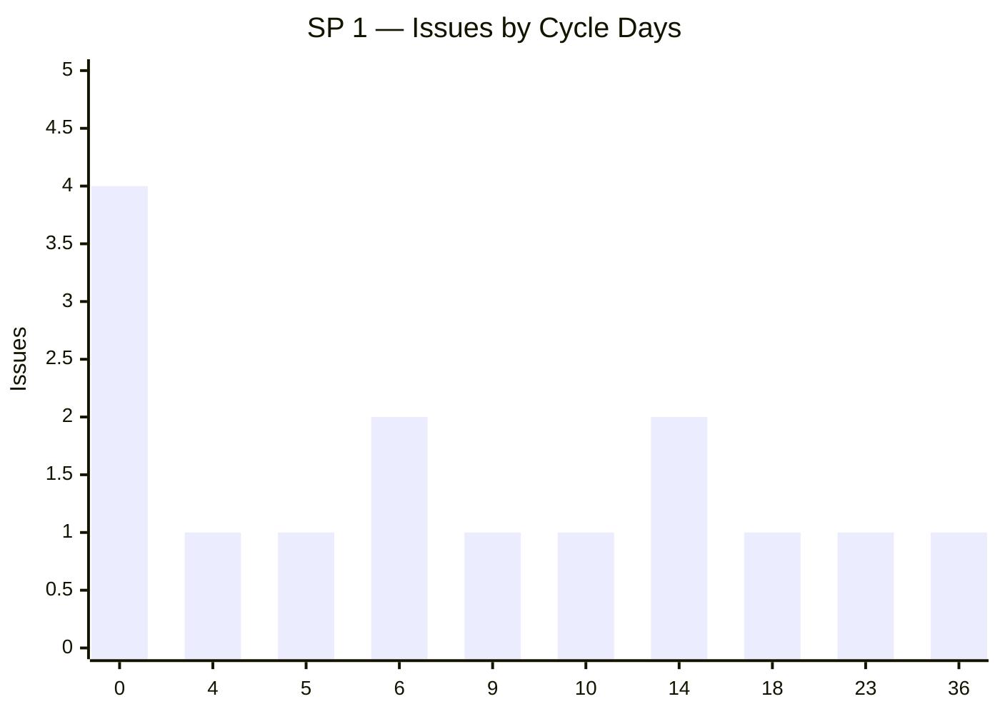
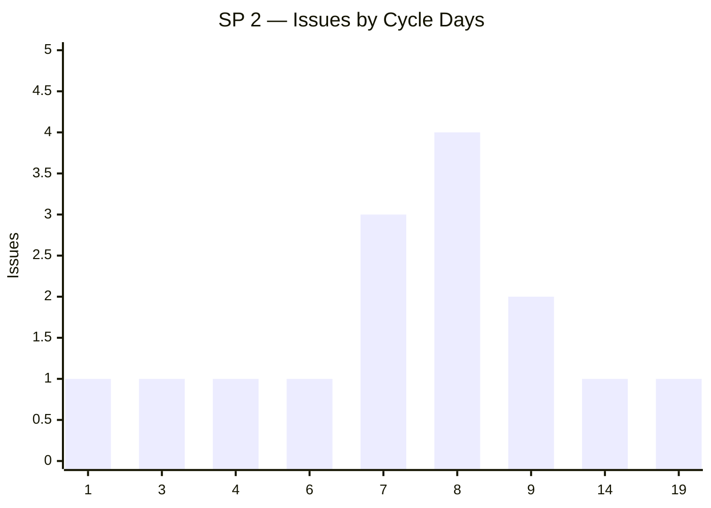
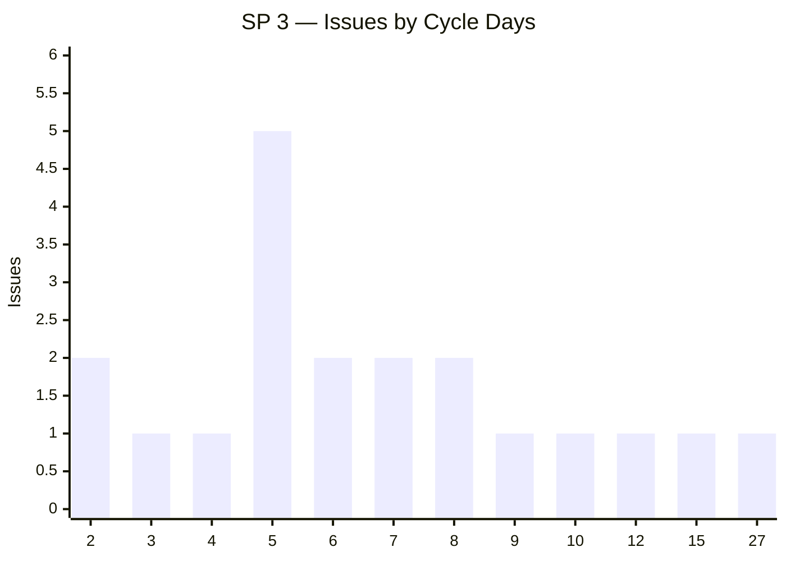
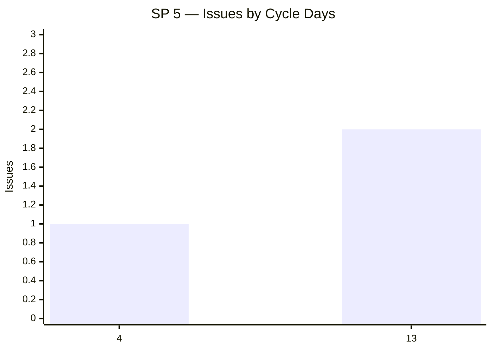
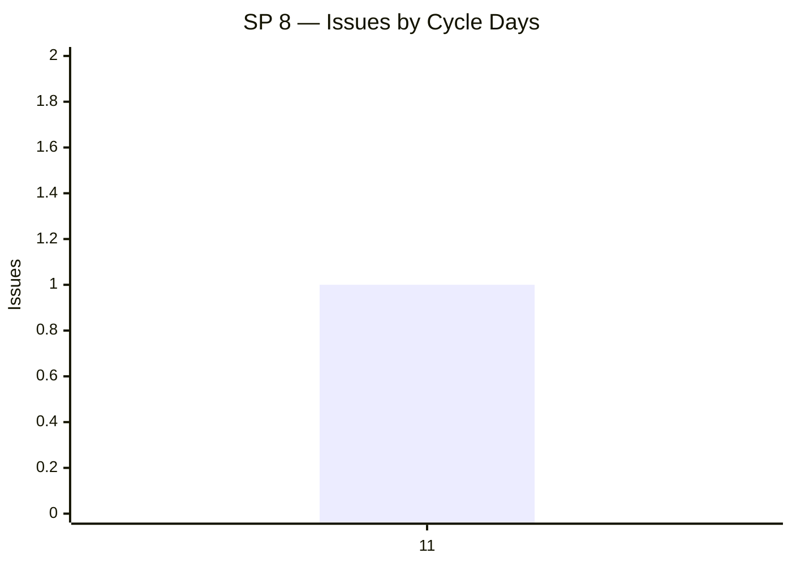

# 📊 BuddyBuilders — Story Point Accuracy Report

_Generated: 2026-06-22 14:34 UTC | Window: last 3 months | Issues analysed: 54_

## 📊 Summary by Story Points

| SP | Count | Mean days | Std Dev | Median | P75 | P95 | Outliers |
|----|-------|-----------|---------|--------|-----|-----|----------|
| 1 | 15 | 9.7 | 9.7 | 5.9 | 13.9 | 26.9 | 2 (13%) |
| 2 | 15 | 7.8 | 4.1 | 7.8 | 8.6 | 15.4 | 2 (13%) |
| 3 | 20 | 7.5 | 5.4 | 6.0 | 8.3 | 15.5 | 2 (10%) |
| 5 | 3 | 10.1 | 4.1 | 12.9 | 12.9 | 13.0 | — |
| 8 | 1 | 11.2 | 0.0 | 11.2 | 11.2 | 11.2 | — |

## 📊 Summary by Story Points (Outliers Removed)

| SP | Count | Mean days | Std Dev | Median | P75 | P95 |
|----|-------|-----------|---------|--------|-----|-----|
| 1 | 13 | 6.6 | 5.7 | 5.8 | 10.0 | 15.5 |
| 2 | 13 | 6.5 | 2.4 | 6.8 | 8.2 | 9.0 |
| 3 | 18 | 6.1 | 2.6 | 5.5 | 7.6 | 10.4 |
| 5 | 3 | 10.1 | 4.1 | 12.9 | 12.9 | 13.0 |

## ⚠️ Outliers (cycle time > mean + 1σ for their SP group)

| Issue | Summary | SP | Cycle days | Ceiling | Over by |
|-------|---------|----|------------|---------|---------|
| [NWAP-200931](https://atc.bmwgroup.net/jira/browse/NWAP-200931) | Change approach to identify BMW M cars on Community | 1 | 35.8 | 19.3 d | +16.5 d |
| [NWAP-202608](https://atc.bmwgroup.net/jira/browse/NWAP-202608) | [JoyUI] Hubpage header on Community | 3 | 27.0 | 13.0 d | +14.0 d |
| [NWAP-200687](https://atc.bmwgroup.net/jira/browse/NWAP-200687) | [JoyUI] Hubpage header on Connected Drive | 1 | 23.0 | 19.3 d | +3.7 d |
| [NWAP-202842](https://atc.bmwgroup.net/jira/browse/NWAP-202842) | Create new subpage to Edit Post | 2 | 19.0 | 11.9 d | +7.1 d |
| [NWAP-202664](https://atc.bmwgroup.net/jira/browse/NWAP-202664) | Update Grafana to Metric-based Dashboard - Community | 3 | 14.9 | 13.0 d | +1.9 d |
| [NWAP-210797](https://atc.bmwgroup.net/jira/browse/NWAP-210797) | Fill Architecture Template for Lifestyle&Acessories Stores | 2 | 13.8 | 11.9 d | +1.9 d |

## 📊 Issue Distribution by Cycle Days

_One chart per Story Point bucket — X axis: cycle days (rounded), Y axis: number of issues._

### SP 1

### SP 2

### SP 3

### SP 5

### SP 8

## 📝 Methodology

Cycle time = calendar days from first _In Progress_ transition to first _Done/Closed/Resolved_ transition.
Outlier = cycle time > mean + 1 standard deviation within the same SP bucket.
All SP buckets are included regardless of size.
Issues without story points or without an _In Progress_ transition are excluded.